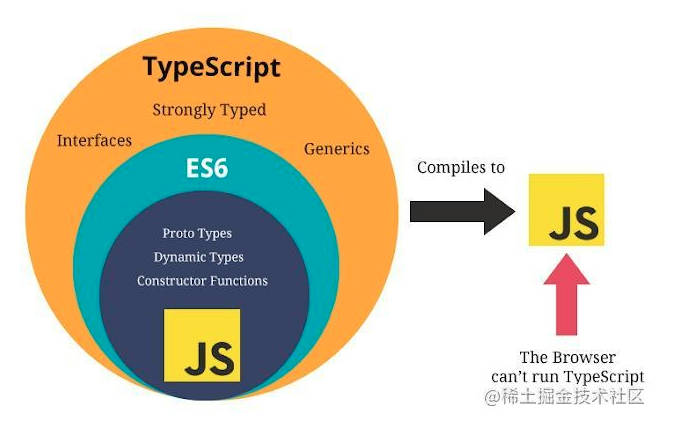

# 初识 TypeScript

## TypeScript 的介绍
TypeScript是一种由微软开发的开源、跨平台的编程语言。它是JavaScript的超集，最终会被编译为JavaScript代码。

2012年10月，微软发布了首个公开版本的TypeScript，2013年6月19日，在经历了一个预览版之后微软正式发布了正式版TypeScript。

TypeScript的作者是安德斯·海尔斯伯格，C#的首席架构师。它是开源和跨平台的编程语言。

TypeScript扩展了JavaScript的语法，所以任何现有的JavaScript程序可以运行在TypeScript环境中。

TypeScript是为大型应用的开发而设计，并且可以编译为JavaScript。

TypeScript 是 JavaScript 的一个超集，主要提供了类型系统和对 ES6+ 的支持，它由 Microsoft 开发，代码开源于 [GitHub](https://github.com/Microsoft/TypeScript)上。
# 常用语法
## 基础类型
### 布尔值
`true` or `false`。
```ts
let isDone: boolean = false;
isDone = true;
// isDone = 2 // error
```
### 数字
二进制，八进制，十进制，十六进制数字。
```ts
let a1: number = 10 // 十进制
let a2: number = 0b1010  // 二进制
let a3: number = 0o12 // 八进制
let a4: number = 0xa // 十六进制
```
### 字符串
`string`。
```ts
let name: string = 'shuai'
name = 'shuaishuai'
// name = 12 // error
let age: number = 12
const info = `My name is ${name}, I am ${age} years old!`
```
### `undefined` 和 `null`
```ts
let u: undefined = undefined
let n: null = null
```
### 数组
类型加[], 或者`Array[]`
```ts
let list1: number[] = [1, 2, 3]
let list2: Array<number> = [1, 2, 3]
```
### 元组 `Tuple`
元组类型允许表示一个已知元素数量和类型的数组，各元素的类型不必相同。
```ts
let t1: [string, number]
t1 = ['hello', 10] // OK
t1 = [10, 'hello'] // Error
```
### 枚举
`enum` 使用枚举类型可以为一组数值赋予名字。
```ts
enum Color {
  Red,
  Green,
  Blue
}
// 枚举数值默认从0开始依次递增
// 根据特定的名称得到对应的枚举数值
let myColor: Color = Color.Green
console.log(myColor, Color.Red, Color.Blue)  // 1 0 2
```
默认情况下，从 `0` 开始为元素编号。 你也可以手动的指定成员的数值。 例如，我们将上面的例子改成从 `1` 开始编号：
```ts
enum Color {
  Red = 1,
  Green,
  Blue
}
// 枚举数值默认从0开始依次递增
// 根据特定的名称得到对应的枚举数值
let myColor: Color = Color.Green
console.log(myColor, Color.Red, Color.Blue)  // 2 1 3
// 根据枚举数值获取名字
let colorName: string = Color[2]
console.log(colorName)  // 'Green'
```
### `any`
```ts
let notSure: any = 4
notSure = 'maybe a string'
notSure = false // 也可以是个 boolean
// 对不知类型的数组
let list: any[] = [1, true, 'free']
list[1] = 100
```
### `void`
```ts
/* 表示没有任何类型, 一般用来说明函数的返回值只能是undefined和null */
function fn(): void {
  console.log('fn()')
  // return undefined
  // return null
  // return 1 // error
}
```
### `object`
`object` 表示非原始类型，也就是除 `number`，`string`，`boolean`之外的类型。
```ts
function fn2(obj:object):object {
  console.log('fn2()', obj)
  return {}
  // return undefined
  // return null
}
console.log(fn2(new String('abc')))
// console.log(fn2('abc') // Argument of type 'string' is not assignable to parameter of type 'object'.
```
### 联合类型
联合类型（`Union Types`）表示取值可以为多种类型中的一种
```ts
let SeriesOfTypes : number | boolean | Error;
SeriesOfTypes = 1111;
// SeriesOfTypes = '1111'; // error
```
### 类型断言
其一是“尖括号”语法, 另一个为 `as` 语法
```ts
let student = {}
// let student: {}

student.name = 'jack'
// 类型“{}”上不存在属性“name”。
student.age = 18
// 类型“{}”上不存在属性“age”。

// 接口
interface Person{
  name:string;
  age: number
}

let student = {} as Person
let student = <Person>{}
// let student: Person

student.name = 'jack'
student.age = 18
```

### 类型推断
```ts
/* 定义变量时赋值了, 推断为对应的类型 */
let b9 = 123 // number
// b9 = 'abc' // error

/* 定义变量时没有赋值, 推断为any类型 */
let b10  // any类型
b10 = 123
b10 = 'abc'
```
## 接口
`TypeScript` 的核心原则之一是对值所具有的结构进行类型检查。我们使用接口（Interfaces）来定义对象的类型。接口是对象的状态(属性)和行为(方法)的抽象(描述)
### 接口初探
需求: 创建人的对象, 需要对人的属性进行一定的约束
```
id是number类型, 必须有, 只读的
name是string类型, 必须有
age是number类型, 必须有
sex是string类型, 可以没有
```
```ts
// 定义人的接口
interface IPerson {
  id: number
  name: string
  age: number
  sex: string
}
```
### 可选属性 `?`
```ts
// 定义人的接口
interface IPerson {
  id: number
  name: string
  age: number
  sex?: string
}
```
### 只读属性 `readonly`
```ts
// 定义人的接口
interface IPerson {
  readonly id: number
  name: string
  age: number
  sex?: string
}
```
### 函数类型
一个只有参数列表和返回值类型的函数定义
```ts
interface SearchFunc {
  (source: string, subString: string): boolean
}
```
这样定义后，我们可以像使用其它接口一样使用这个函数类型的接口。 下例展示了如何创建一个函数类型的变量，并将一个同类型的函数赋值给这个变量。
```ts
const mySearch: SearchFunc = function (source: string, sub: string): boolean {
  return source.search(sub) > -1
}

console.log(mySearch('abcd', 'bc'))
```
### 类类型
```ts
/* 
类类型: 实现接口
1. 一个类可以实现多个接口
2. 一个接口可以继承多个接口
*/

interface Alarm {
  alert(): any;
}

interface Light {
  lightOn(): void;
  lightOff(): void;
}

class Car implements Alarm {
  alert() {
      console.log('Car alert');
  }
}
class Car2 implements Alarm, Light {
  alert() {
    console.log('Car alert');
  }
  lightOn() {
    console.log('Car light on');
  }
  lightOff() {
    console.log('Car light off');
  }
}


interface LightableAlarm extends Alarm, Light {
    sayHellow(): void;
    lightOn(): void;
    lightOff(): void;
    alert(): any;
}
```
## 类
### 基本示例
```ts
/* 
类的基本定义与使用
*/

class Greeter {
  // 声明属性
  message: string

  // 构造方法
  constructor (message: string) {
    this.message = message
  }

  // 一般方法
  greet (): string {
    return 'Hello ' + this.message
  }
}

// 创建类的实例
const greeter = new Greeter('world')
// 调用实例的方法
console.log(greeter.greet())
```
### 类的继承
```ts
/* 
类的继承
*/

class Animal {
  run (distance: number) {
    console.log(`Animal run ${distance}m`)
  }
}

class Dog extends Animal {
  cry () {
    console.log('wang! wang!')
  }
}

const dog = new Dog()
dog.cry() 
dog.run(100) // 可以调用从父中继承得到的方法
```
```ts
class Animal {
  name: string
  
  constructor (name: string) {
    this.name = name
  }

  run (distance: number=0) {
    console.log(`${this.name} run ${distance}m`)
  }

}

class Snake extends Animal {
  constructor (name: string) {
    // 调用父类型构造方法
    super(name)
  }

  // 重写父类型的方法
  run (distance: number=5) {
    console.log('sliding...')
    super.run(distance)
  }
}

class Horse extends Animal {
  constructor (name: string) {
    // 调用父类型构造方法
    super(name)
  }

  // 重写父类型的方法
  run (distance: number=50) {
    console.log('dashing...')
    // 调用父类型的一般方法
    super.run(distance)
  }

  xxx () {
    console.log('xxx()')
  }
}

const snake = new Snake('sn')
snake.run()

const horse = new Horse('ho')
horse.run()

// 父类型引用指向子类型的实例 ==> 多态
const tom: Animal = new Horse('ho22')
tom.run()

/* 如果子类型没有扩展的方法, 可以让子类型引用指向父类型的实例 */
const tom3: Snake = new Animal('tom3')
tom3.run()
/* 如果子类型有扩展的方法, 不能让子类型引用指向父类型的实例 */
// const tom2: Horse = new Animal('tom2')
// tom2.run()
```
### 公共，私有与受保护的修饰符
#### 默认为 `public`
在上面的例子里，我们可以自由的访问程序里定义的成员。 如果你对其它语言中的类比较了解，就会注意到我们在之前的代码里并没有使用 `public` 来做修饰
#### `private`
当成员被标记成 `private` 时，它就不能在声明它的类的外部访问
#### `protected`
`protected` 修饰符与 `private` 修饰符的行为很相似，但有一点不同，`protected` 成员在派生类中仍然可以访问。
```ts
/* 
访问修饰符: 用来描述类内部的属性/方法的可访问性
  public: 默认值, 公开的外部也可以访问
  private: 只能类内部可以访问
  protected: 类内部和子类可以访问
*/

class Animal {
  public name: string

  public constructor (name: string) {
    this.name = name
  }

  public run (distance: number=0) {
    console.log(`${this.name} run ${distance}m`)
  }
}

class Person extends Animal {
  private age: number = 18
  protected sex: string = '男'

  run (distance: number=5) {
    console.log('Person jumping...')
    super.run(distance)
  }
}

class Student extends Person {
  run (distance: number=6) {
    console.log('Student jumping...')

    console.log(this.sex) // 子类能看到父类中受保护的成员
    // console.log(this.age) //  子类看不到父类中私有的成员

    super.run(distance)
  }
}

console.log(new Person('abc').name) // 公开的可见
// console.log(new Person('abc').sex) // 受保护的不可见
// console.log(new Person('abc').age) //  私有的不可见
```
### `readonly` 修饰符
可以使用 `readonly` 关键字将属性设置为只读的。 只读属性必须在声明时或构造函数里被初始化。
```ts
class Person {
  readonly name: string = 'abc'
  constructor(name: string) {
    this.name = name
  }
}

let john = new Person('John')
// john.name = 'peter' // error
```
```ts
class Person2 {
  constructor(readonly name: string) {
  }
}

const p = new Person2('jack')
console.log(p.name)
```
### 存取器
使用 `getters/setters` 截取对对象成员的访问。
```ts
class Person {
  firstName: string = 'A'
  lastName: string = 'B'
  get fullName () {
    return this.firstName + '-' + this.lastName
  }
  set fullName (value) {
    const names = value.split('-')
    this.firstName = names[0]
    this.lastName = names[1]
  }
}

const p = new Person()
console.log(p.fullName)

p.firstName = 'C'
p.lastName =  'D'
console.log(p.fullName)

p.fullName = 'E-F'
console.log(p.firstName, p.lastName)
```
### 静态属性
```ts
/* 
静态属性, 是类对象的属性
非静态属性, 是类的实例对象的属性
*/

class Person {
  name1: string = 'A'
  static name2: string = 'B'
}

console.log(Person.name2)
console.log(new Person().name1)
```
### 抽象类
```ts
/* 
抽象类
  不能创建实例对象, 只有实现类才能创建实例
  可以包含未实现的抽象方法
*/

abstract class Animal {

  abstract cry ()

  run () {
    console.log('run()')
  }
}

class Dog extends Animal {
  cry () {
    console.log(' Dog cry()')
  }
}

const dog = new Dog()
dog.cry()
dog.run()
```
## 函数
### 基本示例
```ts
// 命名函数
function add(x, y) {
  return x + y
}

// 匿名函数
let myAdd = function(x, y) { 
  return x + y;
}
```
### 为函数定义类型
```ts
function add(x: number, y: number): number {
  return x + y
}

let myAdd = function(x: number, y: number): number { 
  return x + y
}
```
### 完整的
``` ts
let myAdd2: (x: number, y: number) => number = 
function(x: number, y: number): number {
  return x + y
}
```
### 可选参数和默认参数
直接在定义参数的时候赋值，可选参数加问号
```ts
function buildName(firstName: string='A', lastName?: string): string {
  if (lastName) {
    return firstName + '-' + lastName
  } else {
    return firstName
  }
}

console.log(buildName('C', 'D'))
console.log(buildName('C'))
console.log(buildName())
```
### 剩余参数
```ts
function info(x: string, ...args: string[]) {
  console.log(x, args)
}
info('abc', 'c', 'b', 'a')
```
### 函数重载
```ts
/* 
函数重载: 函数名相同, 而形参不同的多个函数
需求: 我们有一个add函数，它可以接收2个string类型的参数进行拼接，也可以接收2个number类型的参数进行相加 
*/

// 重载函数声明
function add (x: string, y: string): string
function add (x: number, y: number): number
// 定义函数实现
function add(x: string | number, y: string | number): string | number {
  // 在实现上我们要注意严格判断两个参数的类型是否相等，而不能简单的写一个 x + y
  if (typeof x === 'string' && typeof y === 'string') {
    return x + y
  } else if (typeof x === 'number' && typeof y === 'number') {
    return x + y
  }
}
console.log(add(1, 2))
console.log(add('a', 'b'))
// console.log(add(1, 'a')) // error
```
## 泛型
指在定义函数、接口或类的时候，不预先指定具体的类型，而在使用的时候再指定具体类型的一种特性。
### 单个泛型
```ts
function createArray2 <T> (value: T, count: number) {
  const arr: Array<T> = []
  for (let index = 0; index < count; index++) {
    arr.push(value)
  }
  return arr
}
const arr3 = createArray2<number>(11, 3)
console.log(arr3[0].toFixed())
// console.log(arr3[0].split('')) // error
const arr4 = createArray2<string>('aa', 3)
console.log(arr4[0].split(''))
// console.log(arr4[0].toFixed()) // error
```
### 多个泛型
```ts
function swap <K, V> (a: K, b: V): [K, V] {
  return [a, b]
}
const result = swap<string, number>('abc', 123)
console.log(result[0].length, result[1].toFixed())
```
### 泛型接口
```ts
interface IbaseCRUD <T> {
  data: T[]
  add: (t: T) => void
  getById: (id: number) => T
}

class User {
  id?: number; //id主键自增
  name: string; //姓名
  age: number; //年龄

  constructor (name, age) {
    this.name = name
    this.age = age
  }
}

class UserCRUD implements IbaseCRUD <User> {
  data: User[] = []
  
  add(user: User): void {
    user = {...user, id: Date.now()}
    this.data.push(user)
    console.log('保存user', user.id)
  }

  getById(id: number): User {
    return this.data.find(item => item.id===id)
  }
}


const userCRUD = new UserCRUD()
userCRUD.add(new User('tom', 12))
userCRUD.add(new User('tom2', 13))
console.log(userCRUD.data)
```
### 泛型类
```ts
class GenericNumber<T> {
  zeroValue: T
  add: (x: T, y: T) => T
}

let myGenericNumber = new GenericNumber<number>()
myGenericNumber.zeroValue = 0
myGenericNumber.add = function(x, y) {
  return x + y 
}

let myGenericString = new GenericNumber<string>()
myGenericString.zeroValue = 'abc'
myGenericString.add = function(x, y) { 
  return x + y
}

console.log(myGenericString.add(myGenericString.zeroValue, 'test'))
console.log(myGenericNumber.add(myGenericNumber.zeroValue, 12))
```
## 其他
### 声明文件
当使用第三方库时，我们需要引用它的声明文件，才能获得对应的代码补全、接口提示等功能。
什么是声明语句？
假如我们想使用第三方库 `jQuery`，一种常见的方式是在 `html` 中通过 `script` 标签引入 `jQuery`，然后就可以使用全局变量 `$` 或 `jQuery` 了。
但是在 `ts` 中，编译器并不知道 `$` 或 `jQuery` 是什么东西。
```ts
/* 
当使用第三方库时，我们需要引用它的声明文件，才能获得对应的代码补全、接口提示等功能。
声明语句: 如果需要ts对新的语法进行检查, 需要要加载了对应的类型说明代码
  declare var jQuery: (selector: string) => any;
声明文件: 把声明语句放到一个单独的文件（jQuery.d.ts）中, ts会自动解析到项目中所有声明文件
下载声明文件: npm install @types/jquery --save-dev
*/

jQuery('#foo');
// ERROR: Cannot find name 'jQuery'.
```
这时我们需要使用 `declare var` 定义他的类型
```ts
declare var jQuery: (selector: string) => any;

jQuery('#foo');
```
### 内置类型
#### `Partial`（部分的）
作用是让传入类型中的所有属性变成都是可选的
```ts
interface Student {
  name: string;
  age: number;
}
// const student1: Student = {}  // error
const student2: Partial<Student> = {}
```
#### `Required`（必须的）
跟Partial的作用是相反的，是让传入类型中的所有属性变成都是必填的
```ts
interface Student {
  name?: string;
  age?: number;
}
const student1: Student = {} 
// const student2: Required<Student> = {}  // error
```
#### `Readonly`（只读的）
作用是让传入类型中的所有属性变成都是只读的（不能修改属性）
```ts
interface Student {
  name: string;
  age: number;
}
const student1: Student = {
    name: '李四',
    age: 25,
} 
const student2: Readonly<Student> = {
    name: '张三',
    age: 18,
} 
student2.age = 21 // error
```
#### `Pick`（选择）
作用是选择传入类型中的部分属性组成新类型
```ts
interface Student {
  name: string;
  age: number;
}
const student1: Student = {
    name: '李四',
    age: 25,
} 
const student2: Pick<Student, 'name'> = {
    name: '张三',
} 
const student3: Pick<Student, 'name' | 'age'> = {
    name: '张三',
    age: 20
} 
```
#### `Record`（记录）
作用是构建一个类型，这个类型用来描述一个对象，这个对象的属性都具有相同的类型。
`Record` 应该是日常使用频率较高的内置类型了，主要用来描述对象，一般建议是不用Object来描述对象，而是用 `Record` 代替，`Record<string, any>` 几乎可以说是万金油了
```ts
const student: Record<string, any> = {
    name: '张三',
    age: 20
}
```
#### `Exclude`（排除）
排除相同的，留下不同的
```ts
type StudentAttr = 'name' | 'age' | 'school'
type PersonAttr = 'name' | 'age' 
const student1: Exclude<StudentAttr, PersonAttr> = 'school'
// student1就只能被赋值为'school'
```
#### `Extract`（取出）
留下相同的
```ts
type StudentAttr = 'name' | 'age' | 'school'
type PersonAttr = 'name' | 'age' 
const student1: Extract<StudentAttr, PersonAttr> = 'name'
// student1就只能被赋值为'name'或者'age'
```
#### `Omit`（省略）
传入一个类型，和这个类型的几个属性，把传入的属性省略掉，组成一个新类型
```ts
type StudentAttr = 'name' | 'age' | 'school'
type PersonAttr = 'name' | 'age' 
const student1: Extract<StudentAttr, PersonAttr> = 'school'
// student1就只能被赋值为'school'
```
#### `NonNullable`（不能为null）
不能为null
```ts
interface Student {
  name: string;
  age: number;
}
// const student1: NonNullable<Student | undefined | null> = null // error
```
### 未完待续， 随时补充

附部分参考链接：
1: [ts 接口的属性权限、使用、继承](https://www.jianshu.com/p/990a734178f8)
2: [TypeScript 数据类型——联合类型 (Union Type) 和字面量类型 (Literal Type)](https://blog.csdn.net/m0_45406092/article/details/106856618)
3: [github](https://github.com/24kcs)
4: [TypeScript内置类型一览（Record＜string,any＞等等）](https://blog.csdn.net/qq_32594913/article/details/126147516)
...

以上整理内容来源来自网络，如果认为涉及到了您的合法权益，可以留言联系删除。