你可能不知道的CSS_background

# 你可能不知道的CSS_background
### 前言
Background，写过 CSS 的朋友们肯定都知道这个属性的作用，顾名思义，背景嘛。[MDN](https://developer.mozilla.org/zh-CN/docs/Web/CSS/background) 中对其的定义如下：background 是一种 CSS 简写属性，用于一次性集中定义各种背景属性，包括 color, image, origin 与 size, repeat 方式等等。
#### 我们首先讲一下 Background 的日常语法：
- Background 可以使用简写或者单独设置其中一项：
    - 简写语法
        - 官方推荐顺序为： background: background-color，background-image，background-repeat，background-attachment，background-position;
        - 不强制要求书写顺序
- 单独设置样式
    | 值 | 说明 | 默认值 | 版本 |
    |-----|-----|------|------|
    | background-color | 指定要使用的背景颜色   | transparent |CSS2.1 |
    | background-position | 指定背景图像的位置 | 0%, 0% | CSS2.1 |
    | background-image | 指定要使用的一个或多个背景图像 | none |CSS2.1 |
    | background-repeat | 指定如何重复背景图像 | repeat |CSS2.1 |
    | background-attachment | 设置背景图像是否固定或者随着页面的其余部分滚动。 | scroll |CSS2.1 |
    | background-size | 指定背景图片的大小 | auto | CSS3 |
    | background-origin | 指定背景图像的定位区域 | padding-box |CSS3 |
    | background-clip | 指定背景图像的绘画区域 | border-box	 |CSS3 |

### Background 基础篇
这里给大家展示一下几个常见的 background 的属性的用法：
``` html
<style>
    .div1 {
        width: 100px;
        height: 100px;
        background-color: black;
        background-image: url('./img/wen.png');
        background-size: 50%;
        background-repeat: no-repeat;
    }
</style>
<body>
    <div class="div1"></div>
</body>
```

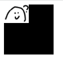

- background-color 背景颜色
    1. 单词：background-color: black;
    2. 十六进制：background-color: #000;
    3. RGB 色彩模式：background-color: rgb(0, 0, 0);
- background-image 背景图片
    1. background-image: url('')
    2. 也可同时设置多张图片，详见进阶篇 - 多背景图片
- background-size 背景图片尺寸
    1. 百分比：background-size: 100%;
    2. 像素值：background-size: 100px;
    3. 当只设置一个值时，默认为宽度，而高度按比例自适应。
- background-repeat 背景图片重复
    1. repeat (重复)：background-repeat: repeat;
    2. repeat-x (横向重复)：background-repeat: repeat-x;
    3. repeat-y (纵向重复)：background-repeat: repeat-y;
    4. no-repeat (不重复)：background-repeat: no-repeat;
### Background 进阶篇
#### 多背景图片 background-image
在 CSS2.1 中，元素只能添加一张背景图片。然而在 CSS3 中，我们可以给元素添加多张背景图片。其兼容性如下图所示：

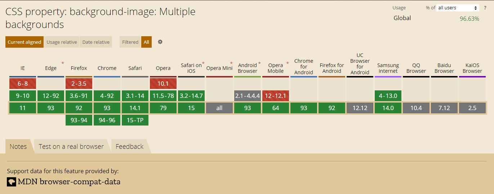

- 多张背景图片可针对每一张设置单独的样式，对应样式用逗号分隔
``` html
<style>
   .div1 {
        width: 100px;
        height: 100px;
        background-color: black;
        background-image: url('./img/wen.png'), url('./img/yuan.jpg');
        background-size: 50%, 100%;
        background-repeat: repeat-x, no-repeat;
    }
</style>
<body>
    <div class="div1"></div>
</body>
```

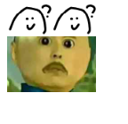

- 那如果图片数量和属性数量不一致呢？
``` html
<style>
.div1 {
        width: 500px;
        height: 500px;
        background-color: black;
        background-image: url('./img/wen.png'), url('./img/yuan.jpg'), url('./img/male.jpg');
        background-size: 50%, 30%;
        background-repeat: repeat-x, repeat-y;
    }
</style>
<body>
    <div class="div1"></div>
</body>

```

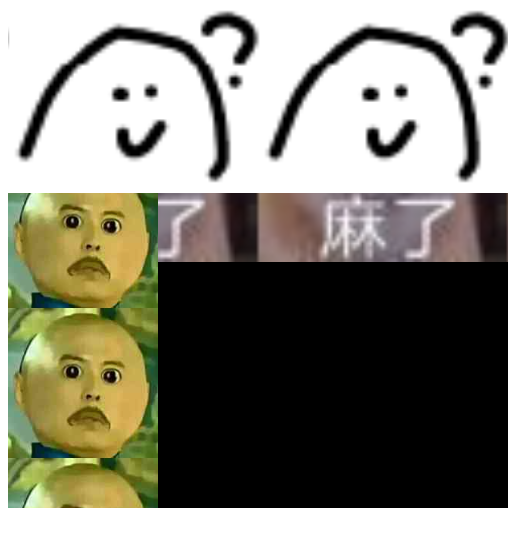

- 多背景图片总结：
    1. 背景图片所生效的样式，是属性值中与图片位置对应的值；
    2. 如果属性值比背景图片的个数要少，那么没有对应的值的图片样式以第一个值为准；
    3. 背景图片的层级按着从左往右，依次减小。当然，层级最低的还是 background-color；
#### 背景渐变 background-image: linear-gradient
背景渐变是基于 background-image 来设置的。具体语法详见[MDN](https://developer.mozilla.org/es/docs/Web/CSS/CSS_Images/Using_CSS_gradients#gradientes_lineales)。其兼容性如下图所示：
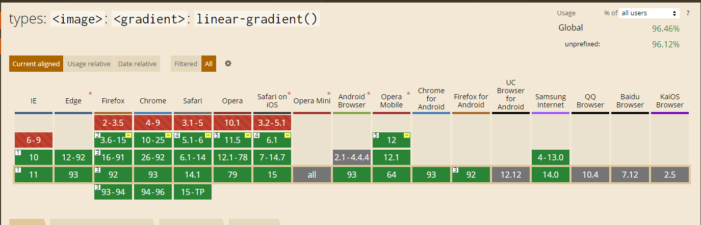

- background-image: linear-gradient 路径渐变（可手动设置方向，默认自上向下）
- linear-gradient() 的用法如下用法: 
    1. background-image: linear-gradient(direction, color-stop1, color-stop2, ...);
        - 例子：background: linear-gradient(用角度值指定渐变的方向（或角度）, 用于指定渐变的起止颜色, 用于指定渐变的起止颜色, ...);
        ``` html
        <style>
            .div1 {
            width: 500px;
            height: 500px;
            background-image: linear-gradient(red, blue); 
        }
        </style>
        <!-- 默认从上到下 -->
        <body>
            <div class="div1"></div>
        </body>
        ```

        
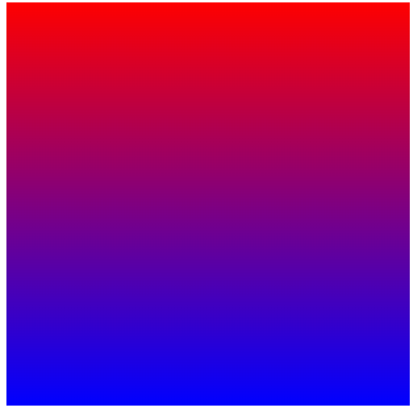
``` html
        <style>
            .div1 {
            width: 500px;
            height: 500px;
            background-image: linear-gradient(to top ,red, blue); 
        }
        </style>
        <!--从下往上 -->
        <body>
            <div class="div1"></div>
        </body>
```
旋转大法好
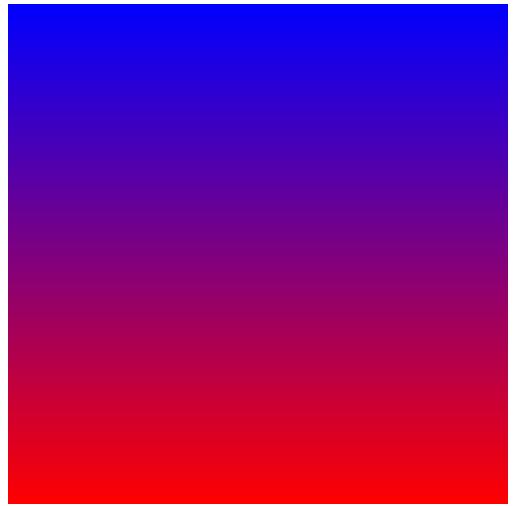
``` html
        <style>
            .div1 {
            width: 500px;
            height: 500px;
            background-image: linear-gradient(to bottom right ,red, blue); 
        }
        </style>
        <!-- 目标色位置右下 -->
        <body>
            <div class="div1"></div>
        </body>
```
转个角度
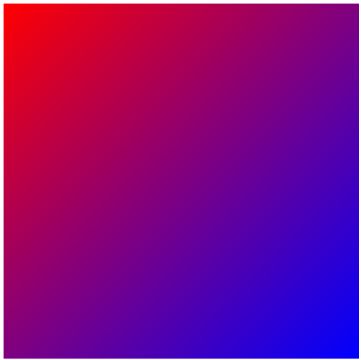
``` html
        <style>
            .div1 {
            width: 500px;
            height: 500px;
            background-image: linear-gradient(45deg ,red, blue); 
        }
        </style>
        <!-- 目标色位置角度 -->
        <body>
            <div class="div1"></div>
        </body>
```
转个角度
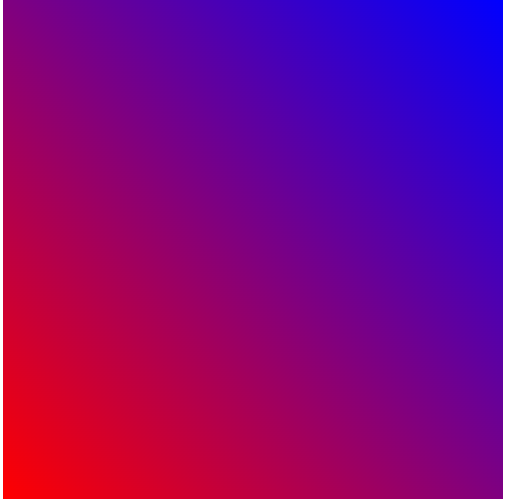
- 在颜色那一块还能加一个参数，前一个元素从什么时候开始渐变，后一个元素的颜色从什么时候开始结束渐变
    ``` html
        <style>
            .div1 {
            width: 500px;
            height: 500px;
            background-image: linear-gradient(red 50%, blue); 
        }
        </style>
        <!-- 红色从高度50%的时候开始渐变（意味着上边50%都是纯红色） -->
        <body>
            <div class="div1"></div>
        </body>
    ```
    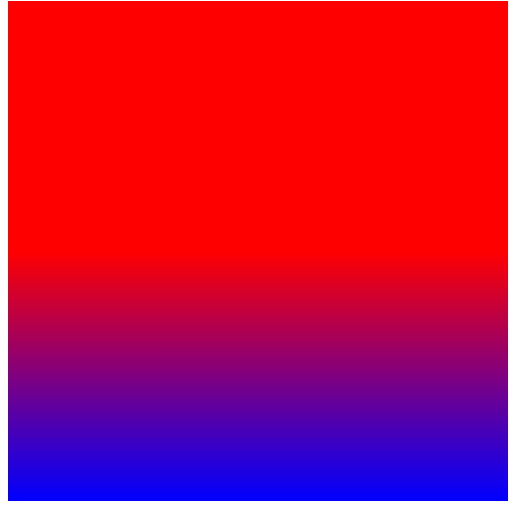
一个有趣的示例，能发现，第一个颜色百分比的权重>倒数第一个>倒数第二个>倒数第三个>...
    ``` html
        <style>
            .div1 {
            width: 500px;
            height: 500px;
            background-image: linear-gradient(red 50%, blue 50%,yellow 60%, green 70%);
        }
        </style>
        <body>
            <div class="div1"></div>
        </body>
    ```
    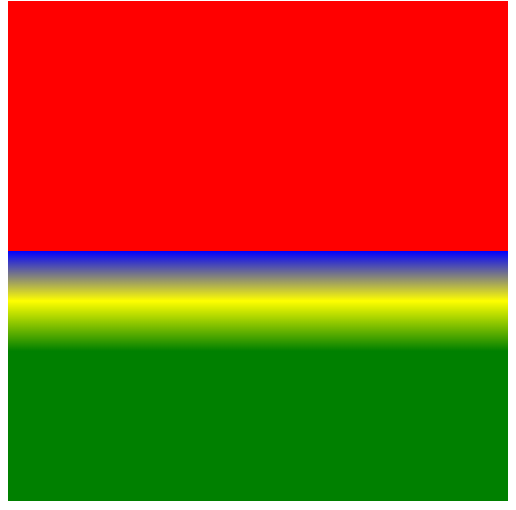
#### 背景渐变 background-image: radial-gradient 径向渐变
- radial-gradient 的用法如下用法: 
    1. background-image: radial-gradient(shape size at position, start-color, ..., last-color);
    
        | 值 | 说明 |
        |-----|-----|
        | shape | 确定圆的类型:   |
        |  | ellipse (默认): 指定椭圆形的径向渐变。 |
        | | circle ：指定圆形的径向渐变 | 
        | size | 定义渐变的大小，可能值： |
        |  | farthest-corner (默认) : 指定径向渐变的半径长度为从圆心到离圆心最远的角 |
        |  | closest-side ：指定径向渐变的半径长度为从圆心到离圆心最近的边 |
        | | closest-corner ： 指定径向渐变的半径长度为从圆心到离圆心最近的角 | 
        |  | farthest-side ：指定径向渐变的半径长度为从圆心到离圆心最远的边 |
        |position|定义渐变的位置。可能值：|
        ||center（默认）：设置中间为径向渐变圆心的纵坐标值。|
        ||top：设置顶部为径向渐变圆心的纵坐标值。|
        ||bottom：设置底部为径向渐变圆心的纵坐标值。|
        |tart-color, ..., last-color|用于指定渐变的起止颜色。|

    2. 基本举例
        ``` html
            <style>
                .div1 {
                width: 500px;
                height: 500px;
                background-color: red;/* 浏览器不支持的时候显示 */
                background-image: radial-gradient(red, green, blue); /* 标准的语法（必须放在最后） */
            }
            </style>
            <body>
                <div class="div1"></div>
            </body>
        ```
        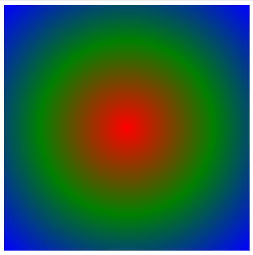
        ``` html
            <style>
                .div1 {
                width: 500px;
                height: 500px;
                background-color: red;/* 浏览器不支持的时候显示 */
                background-image: radial-gradient(red 5%, green 15%, blue 60%); /* 标准的语法（必须放在最后） */
            }
            </style>
            <body>
                <div class="div1"></div>
            </body>
        ```
        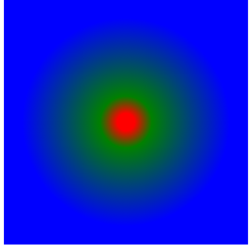
    3. 径向渐变方式主要由`<position>、<shape>、<size>`这三个参数影响，分别控制椭圆的圆心、形状和大小
        - position: 定义渐变的圆心，默认是center center(`<position>`: x轴 y轴,以左上角为原点)
            1. 关键字:X轴：left: 0% center: 50% right: 100%;Y轴: top: 0% center: 50% bottom: 100%；
            ``` html
            <style>
                .div1 {
                    background-image:radial-gradient(at left top, rgb(255, 0, 0), rgb(0, 0, 255))
                }
                
            </style>
            ```
            2. 数值：x轴数值表示在x轴上离0点(渐变框左上角)的偏移量；y轴数值表示在y轴上离0点的偏移量
            ``` html
            <style>
                .div1 {
                    background-image:radial-gradient(at 60px 50px, rgb(255, 0, 0), rgb(0, 0, 255))
                }
                
            </style>
            ```
            3. 百分比：其中x轴的百分比相对于渐变框的宽度，而y轴的百分比相对于渐变框的高度。渐变框的宽高由background-size决定
            ``` html
            <style>
                .div1 {
                background-image:radial-gradient(at 10% 10%, rgb(255, 0, 0), rgb(0, 0, 255))
                }
            </style>
            ```
            4. 单个值：当只有一个值时，默认第二个值为center。
        - shape： 定义渐变的形状是圆circle或椭圆ellipse。默认是椭圆
            ``` html
            <style>
                .div1 {
                background-image:radial-gradient(circle, rgb(255, 0, 0), rgb(0, 0, 255))
                }
            </style>
            ```
            1. 如果`<shape>`是circle，则`<size>`可以设置为`<length>`，表示直径。
            [注意]不能为负值也不可以设置百分比
                ``` html
                <style>
                    .div1 {
                    background-image:radial-gradient(circle 100px, rgb(255, 0, 0), rgb(0, 0, 255))
                    }
                </style>
                ```
            2. 如果`<shape>`是ellipse或不设置时，则`<size>`可以设置为`<length>`或`<percentage>`，第一个值表示水平直径，第二个值表示垂直直径。百分比相对于径向渐变容器的尺寸
                [注意]若只有一个值，则表示水平和垂直直径相同，因为圆是特殊的椭圆，所以一个值时不可以为百分比
                [注意]和圆类似，`<size>`值不能为负值，因为其表示的是直径
                [重要]由于webkit浏览器在使用circle或ellipse关键字时渲染不正常，所以若使用circle时，可以不写shape(默认为ellipse)，用水平和垂直直径相同的椭圆替代
                ``` html
                <style>
                    .div1 {
                    background-image:radial-gradient(50% 50%, rgb(255, 0, 0), rgb(0, 0, 255))
                    }
                    .div2 {
                        background-image:radial-gradient(50% 50% at 100px 100px, rgb(255, 0, 0), rgb(0, 0, 255))
                    }
                </style>
                ```
                关键字
                `<size>`: closest-side | closest-corner | farthest-side | farthest-corner
                ``` html
                <style>
                    .div1 {
                    background-image: radial-gradient(farthest-side at 60% 55%, red, yellow, black);
                    }
                </style>
                ```
                 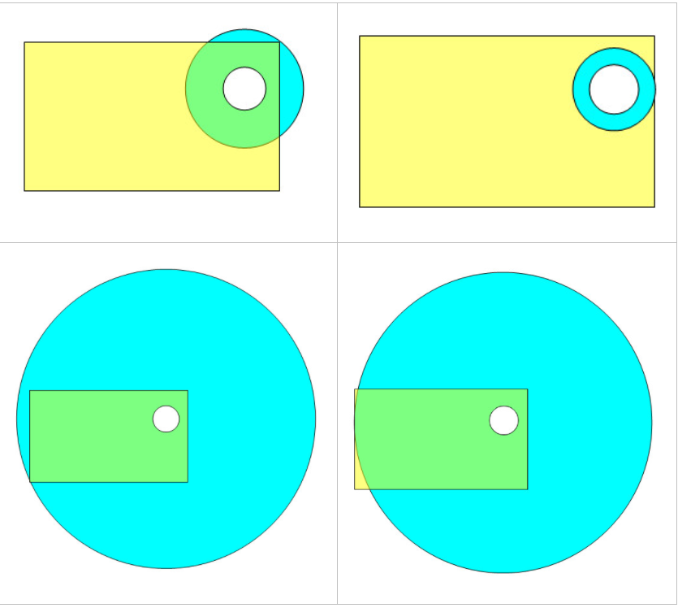
####  重复渐变
- background-image: repeating-linear-gradient 径向渐变
    ``` html
        <style>
            .div1 {
            background-image: repeating-linear-gradient(45deg, #71c9ce 20px, #a6e3e9 30px, #e3fdfd 40px);
            }
        </style>
    ```
    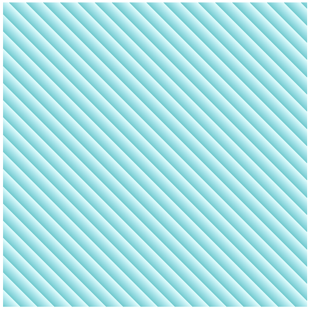
- background-image: repeating-radial-gradient 只有当首尾两颜色位置不在0%或100%时，重复渐变才生效
    ``` html
        <style>
            .div1 {
            background-image:repeating-radial-gradient(rgb(255, 0, 0) 0%, rgb(0, 0, 255) 10%)
            }
        </style>
    ```
    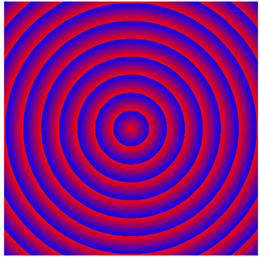
####  背景定位
- 背景定位 background-position
    1. background-position 默认的定位为 padding-box 盒子的左上角。
        - 百分比（%）
        - 像素（px）
        - 位置（top | right | bottom | left | center）
        - 在只设置一个值的时候，另外一个值默认为 center 或 50% 。padding-box 盒子的左上角坐标为 (0, 0) / (left, top)，右下角为 (100, 100) / (right, bottom)。
    ``` html
        <style>
            /* 6 */
            .div2 {
                margin: 100px 100px 0 0;
                float: right;
                width: 500px;
                height: 500px;
                border: 20px solid red;
                padding: 100px;
                box-sizing: border-box;
                background-image: url('./img/male.jpg');
                background-size: 50%;
                background-repeat: no-repeat;
                background-position: right;
            }
        </style>
    ```
    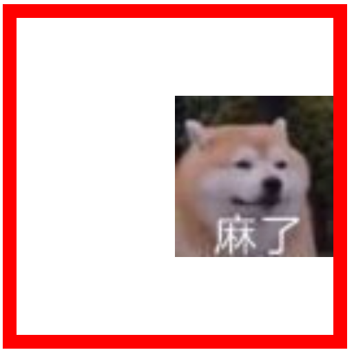
####  背景重复
- background-repeat
    1. background-repeat 除了常见的几个 repeat、repeat-x，repeat-y 以及 no-repeat 以外，还在CSS3 中新加了两个值： space 和 round。其兼容性如下图所示：
    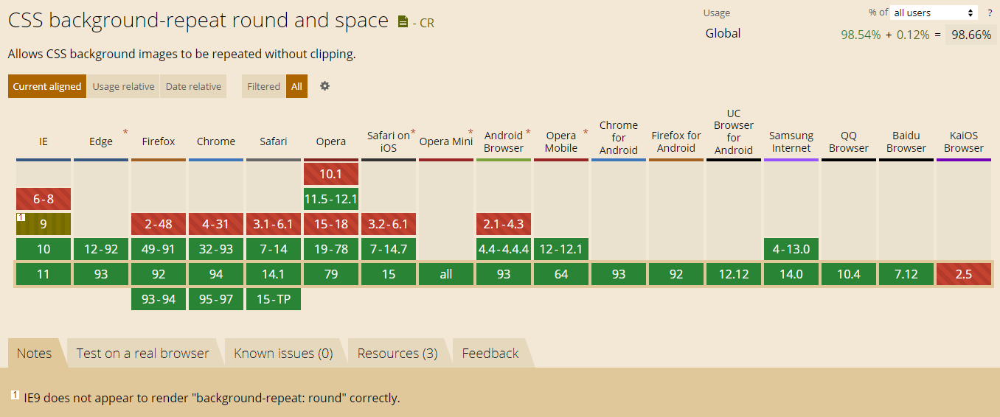
        - background-repeat:space 在保证不缩放的前提下尽可能多的重复图片，并等分图片中间的空隙
        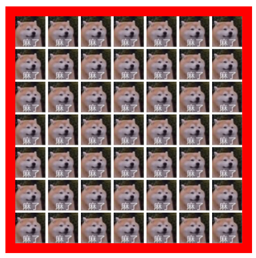
        - background-repeat:round 在尽可能多的重复图片的前提下，拉伸图片以铺满容器
        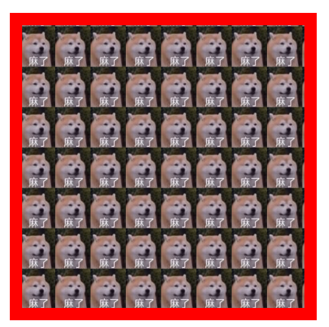
        - 背景图片大于容器时
            1. background-repeat:space 在不缩放的前提下裁剪图片，只保留在容器内的部分
            2. background-repeat:round 缩小图片以铺满容器，长宽与容器尺寸一致（未按比例缩放，图片极有可能变形）
#### 背景相对位置 background-origin
    background-origin 属性规定 background-position 属性相对于什么位置来定位。属性值有 content-box 、padding-box 、border-box 三个，默认为 padding-box。

```html
    <style> 
    .div2 {
    margin: 100px 100px 0 0;
    float: right;
    width: 500px;
    height: 500px;
    border: 20px solid red;
    padding: 100px;
    box-sizing: border-box;
    background-image: url('./img/male.jpg');
    /* background-size: 50%; */
    background-repeat: no-repeat;
    /* background-position: left top; */
    background-origin: border-box;
}
    </style>
```
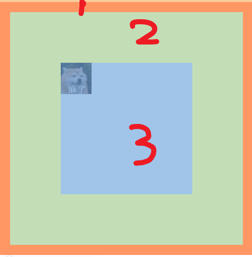

#### 背景绘制区域 background-clip
background-clip 属性规定背景的绘制区域。默认值为 border-box，其属性值同 background-origin 一样，不过表现大不相同。
这个属性范围要大于background-origin，不然可能就回变成这样。
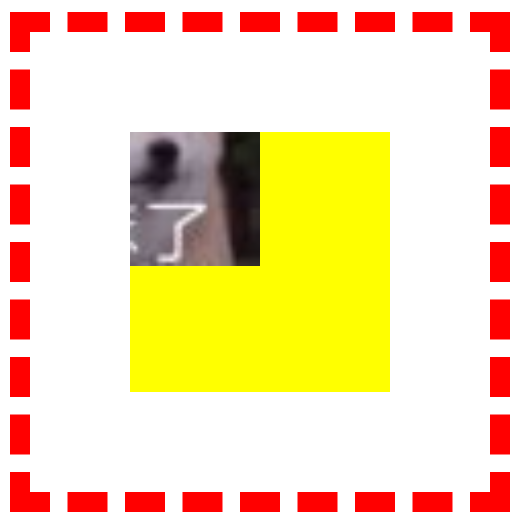
#### 背景大小 background-size
感觉这个属性很常见吧，其实它也是 CSS3 中新加的属性。 CSS2.1 中，背景图片大小是无法设置的。background-size 除了常见的设置大小和百分比之外，还有两个特殊的属性：contain 和 cover
- background-size: contain 图片长宽不相同时，把图片按比例缩小至较长的一方完全适应内容区域为止，多用于背景图片比元素大的情况。
- background-size: cover 图片长宽不相同时，把图片按比例放大至较短的一方完全适应内容区域为止，以使背景图像完全覆盖背景区域，多用于背景图片比元素小的情况。（比例不同会截掉部分图片）

#### 背景固定 background-attachment
有时候在一些网站上会看到，滚动页面的时候，背景图片是固定的。那就是使用 background-attachment: fixed 做到的。
 - background-attachment: fixed 背景固定
 - background-attachment: scroll 背景随页面滚动而滚动（默认）