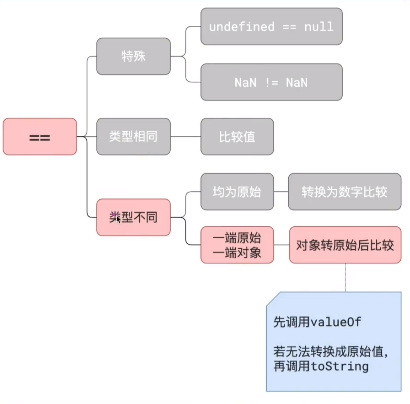

# 002a==1&&a==2&&a==3为true
在一般情况下，我们项目中都会使用===来避免隐式转换的问题。
### 一张图

### a为多少，上述例子成立
```javascript
var a = {
    n: 1,
    valueOf: function(){
        return n++;
    }
}
console.log(a==1&&a==2&&a==3)
```