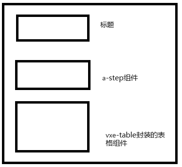

# vue3 中的父子组件传递 slot 的方式

### 缘起

目前的 vue3 工程，有处相似的地方，上面是一个 a-step 组件，下面是一个 vxetable 的组件，目前有好几处都是各自复制这两个组件，进行各自的处理。所以就要把这处，改成一个组件，供小伙伴们使用。

### 分析

大组件套了两个小组件是没有问题的，但是卡在一个地方，vxetable 的组件，可能会使用多个具名插槽。所以意思就是说，在父组件的具名插槽，需要原样传递给子组件，然后子组件里面需要把这个插槽，再原样传递给 vxetable 的组件，最终就达到这么一个效果。



### 实现

父组件

```js
<parentCom title="标题名字" :statusConfig="statusConfig" :tableConfig="tableConfig">
    <template #slotName="{ row }">
        <span v-if="row.name">{{ row.name }}</span>
        <a class="a-link" v-else>选择</a>
    </template>
    <template #slotName2="{ row }">
        <span v-if="row.name2">{{ row.name2 }}</span>
        <a class="a-link" v-else>选择</a>
    </template>
</parentCom>
```

子组件

```html
<div class="process-box">
  <div class="title">
    <span class="left">{{ props.title }}</span>
  </div>
  <div class="step-box">
    <stepCom :statusConfig="props.statusConfig"></stepCom>
  </div>
  <div style="width: 100%; height: 290px">
    <tableCom :tableConfig="props.auditTableConfig">
      <!-- 这里就是最重要的部分 -->
      <template v-for="(slot, name) in $slots" :key="name" #[name]="{ row }">
        <slot :name="name" :row="row"></slot>
      </template>
    </tableCom>
  </div>
</div>
```

### 总结

需要加上一个 template 标签，然后循环所有的插槽，然后把插槽的 name，和 row 传递给子组件，子组件再把这个插槽原样传递给孙组件。

```html
<template v-for="(slot, name) in $slots" :key="name" #[name]="{ row }">
  <slot :name="name" :row="row"></slot>
</template>
```
