# CSS backdrop-filter简介：毛玻璃、磨砂效果
前两天在实现设计稿的时候，发现有个磨砂的效果，网上搜索了下使用到了这个css，赶完工以后回过头来，看下这个东西，浅浅的记录一下用法。
## 在mdn上可以看到详细的介绍
可以让你为一个元素后面区域添加图形效果（如模糊或颜色偏移）。因为它适用于元素背后的所有元素，为了看到效果，必须使元素或其背景至少部分透明。
```
/* 关键词值 */
backdrop-filter: none;

/* 指向 SVG 滤镜的 URL */
backdrop-filter: url(commonfilters.svg#filter);

/* <filter-function> 滤镜函数值 */
backdrop-filter: blur(2px);
backdrop-filter: brightness(60%);
backdrop-filter: contrast(40%);
backdrop-filter: drop-shadow(4px 4px 10px blue);
backdrop-filter: grayscale(30%);
backdrop-filter: hue-rotate(120deg);
backdrop-filter: invert(70%);
backdrop-filter: opacity(20%);
backdrop-filter: sepia(90%);
backdrop-filter: saturate(80%);

/* 多重滤镜 */
backdrop-filter: url(filters.svg#filter) blur(4px) saturate(150%);

/* 全局值 */
backdrop-filter: inherit;
backdrop-filter: initial;
backdrop-filter: revert;
backdrop-filter: unset;
```
## 对滤镜的简介
| 参数 |备注 |
|-----|-----|
| backdrop-filter: blur(10px) | 模糊   |
| backdrop-filter: brightness(60%) | 亮度   |
| backdrop-filter: contrast(40%)|  对比度   |
| backdrop-filter: drop-shadow(4px 4px 10px blue) | 投影   |
| backdrop-filter: grayscale(30%) | 灰度   |
| backdrop-filter: hue-rotate(120deg) | 色调变化   |
| backdrop-filter: invert(70%) | 反向   |
| backdrop-filter: opacity(20%) | 透明度   |
| backdrop-filter: sepia(90%) | 饱和度   |
| backdrop-filter: saturate(80%) | 褐色   |
## 搞点例子看看
为了简单，我们使用一张图片，加一个 `p` 标签，将 `p` 标签绝对定位到图片的底部看效果 `p` 标签的背景我们使用透明背景。注意：必须使元素或其背景至少部分透明。
### 1. 原图
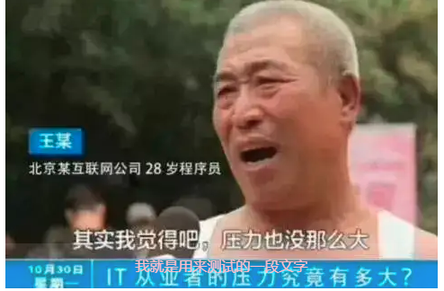
### 2. blur 模糊
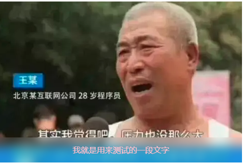

    值越大越看不清背景
### 3. brightness 亮度
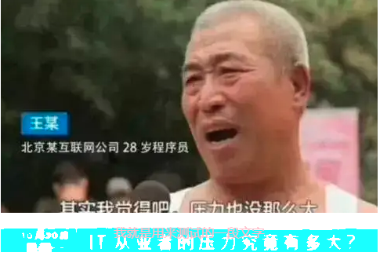

    值越大背景越亮，0 是纯黑色
### 4. contrast 对比度
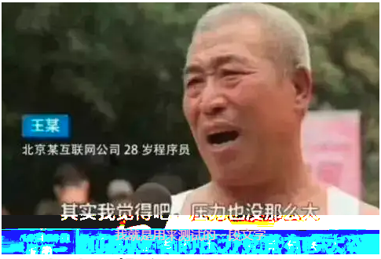

    0是灰色的，值越大 对比度越大。
### 5. drop-shadow 投影
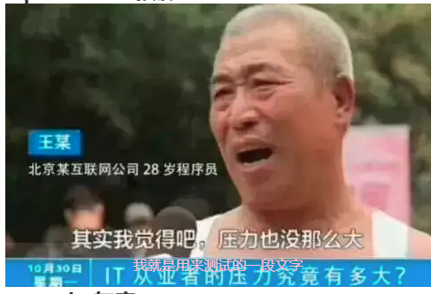
### 6. grayscale 灰度
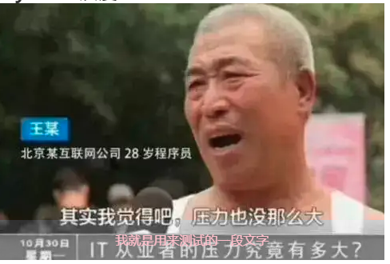

    100%为背景黑白色，0 则无变化
### 7. hue-rotate 色调变化
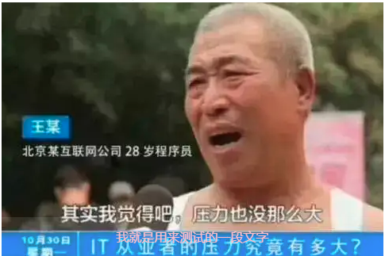
### 8. invert 反向
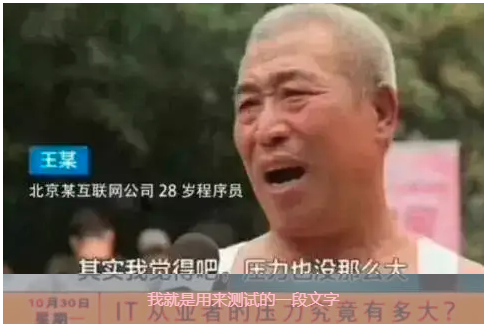
### 9. opacity 透明度
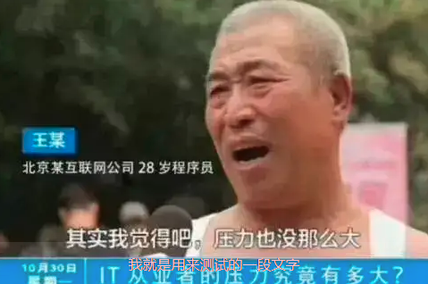
### 10. sepia 饱和度
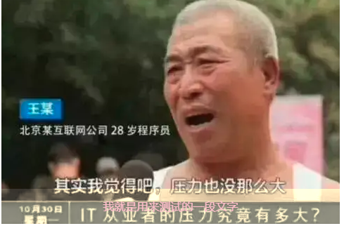
### 11. saturate 褐色
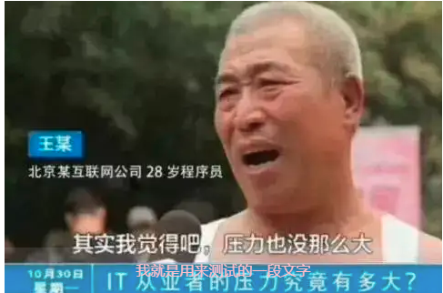
## 完整demo可以点击下面链接打开, 打开调试工具更改样式。
[点我查看CSS backdrop-filter简介：毛玻璃、磨砂效果例子](https://yydha.gitee.io/html-demo/html/CSS backdrop-filter简介：毛玻璃、磨砂效果.html)