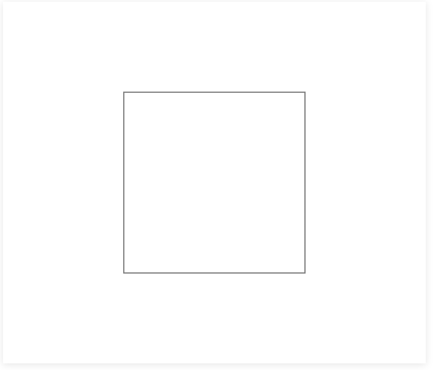

# canvas 详细入门教程

## cavas 是什么？

### cavas 标签本身
canvas标签是一张画布，如果你写了一个canvas标签，打开浏览器预览一下会是这样子的。
```
<!DOCTYPE html>
<html lang="en">
<head>
    <meta charset="UTF-8">
    <meta http-equiv="X-UA-Compatible" content="IE=edge">
    <meta name="viewport" content="width=device-width, initial-scale=1.0">
    <title>canvas详细入门教程</title>
</head>
<body>
    <canvas>你的浏览器不支持canvas，快去升级浏览器吧！</canvas>
</body>
</html>
```

canvas标签只是一个默认长300像素，宽150像素的白色画布。为了让demo更加的清楚，以下例子浅浅的加了下box-shadow和水平居中。
如果你觉得这个画布太小了，施展不开，那么你可以通过标签属性来自定义宽高：
```
<canvas class="canvas" width="800" height="400">你的浏览器不支持canvas，快去升级浏览器吧！</canvas>
```


这里注意，设置画布的宽高只能在html标签里通过height和width属性来设置(canvas标签有且只有这两个属性)，当没有设置宽度和高度的时候，canvas 会初始化宽度为 300 像素和高度为 150 像素。该元素可以使用CSS来定义大小，但在绘制时图像会伸缩以适应它的框架尺寸：如果 CSS 的尺寸与初始画布的比例不一致，它会出现扭曲变形。
通俗一点就是，宽高请设置在标签上，宽高请设置在标签上，宽高请设置在标签上。

## 详细教程
### 基本步骤
我们以现实生活中画画为例：如果我们要画一幅画，要有以下的准备步骤：
1. 首先要有一用来画画的纸；

2. 找到这张纸；

3. 决定是画二维还是三维的画。

我们一一类比到canvas上面
1. 首先要有一用来画画的纸；
```html
<!-- 图片例子3 -->
<canvas class="canvas" id="canvas1" width="700" height="600">你的浏览器不支持canvas，快去升级浏览器吧！</canvas>
```
2. 找到这张纸；
```js
// 我们现在要使用JS获得这个canvas标签的DOM对象：
const canvas = document.getElementById('canvas1');
```
3. 决定是画二维还是三维的画。
```js
const ctx = canvas.getContext('2d');
```
这三行代码的必须条件，由于都是相同的，以下示例代码不再重复。
### 坐标系
Canvas 使用的是 W3C 坐标系 ，也就是遵循我们屏幕、报纸的阅读习惯，从上往下，从左往右。

### 绘制基本图形

#### 画线段
画线之前你需要知道canvas上下文的以下几个api：

    moveTo(x,y)：定义画线的起始点；

    lineTo(x,y)：定义画线的折点；

    stroke()：通过线条来绘制图形轮廓
```js
ctx.moveTo(100, 300); // 起点
ctx.lineTo(500, 300); // 终点
ctx.stroke(); // 使用线条绘制起点和终点
```

当然 你可以多画几条线段
```js
ctx.moveTo(100, 300); // 起点
ctx.lineTo(500, 300); // 终点
ctx.lineTo(500, 200); // 终点
ctx.stroke(); // 使用线条绘制起点和终点

ctx.moveTo(100, 500); // 起点
ctx.lineTo(500, 500); // 终点
ctx.stroke(); // 使用线条绘制起点和终点
```


##### 给线段设置样式
    strokeStyle = '颜色'：设置线的颜色；

    lineWidth = 数字：设置线的宽度；

    lineCap = 'round/butt/square'：设置线帽为圆型/默认/方形；

    lineJoin = 'miter/round/bevel'：设置线段连接处为默认/圆形/平直形式；

    globalAlpha = 数字：设置图案的透明度

一个简单的示例，设置一条线的线宽：

这里有一个地方需要注意，就是样式的设置必须写在绘制图形轮廓（stroke()）方法之前。
##### 画两条线段分别设置样式
```js
ctx.moveTo(200, 200)
ctx.lineTo(500, 200)
ctx.strokeStyle = 'skyblue' // 设置为天蓝色
ctx.lineWidth = 20
ctx.lineCap = 'round'
ctx.stroke()
// 绘制第二条线：
ctx.moveTo(200, 300)
ctx.lineTo(500, 300)
ctx.strokeStyle = 'red'
ctx.lineWidth = 20
ctx.lineCap = 'round'
ctx.stroke()
```

我们发现问题了，下面的样式覆盖了上面的样式。这时候，我们需要另外两方法：

    beginPath()：开启一条新路径，生成之后，图形绘制命令会被指向到新路径上；

    closePath()：关闭上一条路径的绘制
```js
// 两条线段分别设置样式
ctx.beginPath()
ctx.moveTo(200, 200)
ctx.lineTo(500, 200)
ctx.strokeStyle = 'skyblue' // 设置为天蓝色
ctx.lineWidth = 20
ctx.lineCap = 'round'
ctx.stroke()
ctx.closePath()

// 绘制第二条线：
ctx.beginPath()
ctx.moveTo(200, 300)
ctx.lineTo(500, 300)
ctx.strokeStyle = 'red'
ctx.lineWidth = 20
ctx.lineCap = 'round'
ctx.stroke()
ctx.closePath()
```
这样就能达到我们想要的结果。

在画第二条线的时候只需要开启（beginPath()）新路径即可，两条线仍然可以分别设置样式，但是为了规范起见，还是建议写上closePath();
stroke()这个方法也只用最后执行一次，其实也能把线段绘制出来；但是为了规范起见，也还是建议写上。
#### 画三角形
画三角形其实也是用画线的思路，只需要注意首尾点连接起来。
```js
// 举例
ctx.beginPath()
ctx.moveTo(100, 300); // 起点
ctx.lineTo(500, 300);
ctx.lineTo(300, 100);
ctx.lineTo(100, 300); // 终点得等于起点
ctx.stroke(); // 使用线条绘制起点和终点
ctx.closePath()
```

样式和线段一样，此处不在赘述。
```js
ctx.beginPath()
ctx.moveTo(100, 300); // 起点
ctx.lineTo(500, 300);
ctx.lineTo(300, 100);
ctx.lineTo(100, 300); // 终点得等于起点
ctx.strokeStyle = 'pink'
ctx.lineWidth = 20
ctx.stroke(); // 使用线条绘制起点和终点
ctx.closePath()
```

我们发现了，衔接处（100,300）的地方衔接不太丝滑。我们可以去掉最后一根加的线段，将closePath() 方法提前，这个方法可以将起点和末尾的点丝滑的衔接起来。
```js
ctx.beginPath()
ctx.moveTo(100, 300); // 起点
ctx.lineTo(500, 300);
ctx.lineTo(300, 100);
// ctx.lineTo(100, 300); // 这个可以不要啦
ctx.closePath()
ctx.strokeStyle = 'pink'
ctx.lineWidth = 20
ctx.stroke(); // 使用线条绘制起点和终点
```


#### 画矩形

##### 空心矩形
1. 第一种思路就是和实现三角形一样，用线段画出来。
```js
ctx.beginPath()
ctx.moveTo(200, 150)
ctx.lineTo(500, 150)
ctx.lineTo(500, 450)
ctx.lineTo(200, 450)
ctx.closePath()
ctx.stroke()
```

2. 第二种方法是直接使用ctx身上的strokeRect()方法:
```js
ctx.beginPath()
ctx.strokeRect(200, 150, 300, 300) // 起点为(200,150)，宽300像素，高300像素
ctx.closePath()
```
3. 将strokeRect()方法分开，先使用rect()，后stroke()方法，也能达到上述效果。
##### 实心矩形
绘制填充矩形有两种方式。
1. 只需要将strokeRect()方法和strokeStyle()方法的"stroke"改成"fill"即可。

        fillStyle = '颜色'：选择填充色
```js
 // 实心矩形
ctx.beginPath()
ctx.fillStyle = 'pink' // 填充颜色一定要写在生成矩形（fillRect()）之前，否则颜色不生效
ctx.fillRect(200, 150, 300, 300) // 起点为(200,150)，宽300像素，高300像素
ctx.closePath()
```

2. 同理，fillRect()，将fillRect()方法分开，先使用rect()，后fill()方法，也能达到上述效果。

#### 画圆弧 / 圆
绘制圆弧通常有两种方式。
1. 使用 `arc(x, y, radius, startAngle, endAngle, anticlockwise)` (参数分别为：圆心x轴坐标，圆心y轴坐标，半径，旋转角度，true/ false (true逆时针/false顺时针 ))方法生成，再使用stroke()方法绘制圆。

```js
ctx.beginPath()
ctx.arc(350, 300, 150, 0, [(Math.PI) / 180] * 360) // 不写anticlockwise项的话默认为顺时针
ctx.stroke() // 如果此处改为使用fill()方法，那么将会绘制出填充的圆
```

```js
// 逆时针画个圆弧
ctx.beginPath()
ctx.arc(350, 300, 150, 0, [(Math.PI) / 180] * 30, true) // (Math.PI) / 180 === 1°
ctx.stroke()
```

```js
// 圆和线段
ctx.beginPath()
ctx.arc(350, 300, 150, [(Math.PI) / 180] * 30, [(Math.PI) / 180] * 330)
ctx.lineTo(350, 300)
ctx.closePath() // 用于连接首尾点
ctx.stroke()
```


2. 使用 `arcTo(x1, y1, x2, y2, radius)` (参数分别为：1x轴坐标，1y轴坐标，2x轴坐标，2y轴坐标，半径）方法生成，再使用stroke()方法绘制圆。
```js
ctx.moveTo(200, 300) // 定义线段的起点
ctx.arcTo(400, 100, 400, 500, 100) // 切线交点坐标为(400,100)，结束点为(400,500)
ctx.lineWidth = 2
ctx.stroke()
```


#### 画椭圆
使用 `ellipse(x, y, radiusX, radiusY, rotation, startAngle, endAngle, anticlockwise)` （椭圆圆心的 x 轴坐标，椭圆圆心的 y 轴坐标，椭圆长轴的半径，椭圆短轴的半径，椭圆的旋转角度，以弧度表示 (非角度度数)，将要绘制的起始点角度，从 x 轴测量，以弧度表示 (非角度度数)，椭圆将要绘制的结束点角度，以弧度表示 (非角度度数)，Boolean 选项，如果为 true，逆时针方向绘制椭圆（逆时针），反之顺时针方向绘制）方法来绘制椭圆


#### 贝塞尔曲线
##### 二次贝塞尔曲线
同arcTo()方法一样，在它前边也会有一个开始点坐标，一般由moveTo()或lineTo()方法提供；使用quadraticCurveTo(x1,y1,x2,y2)方法来绘制二次贝塞尔曲线；通过起点，控制点，终点控制位置。
在这推荐给大家一个在线调试二次贝塞尔曲线的小工具，大家可以在这里调节好之后，复制代码到IDE里即可：http://blogs.sitepointstatic.com/examples/tech/canvas-curves/quadratic-curve.html

##### 三次贝塞尔曲线
二次贝塞尔曲线由一个控制点控制，而三次贝塞尔曲线由两个控制点来控制。
使用bezierCurveTo(x1,y1,x2,y2,x3,y3)来绘制三次贝塞尔曲线。
同样，三次贝塞尔曲线也有调试工具，可以手动调节到目标曲线，再复制右侧代码即可：http://blogs.sitepointstatic.com/examples/tech/canvas-curves/bezier-curve.html

#### 画虚线
使用 `setLineDash([])` 方法来绘制虚线，`setLineDash([])` 方法可以接收若干个参数。`setLineDash([])` 里的数组参数会“铺开”，下标为偶数的项为实线，为奇数项为透明线段，数字的大小代表着线段的长度
```js
ctx.beginPath()
ctx.lineWidth = 10
ctx.strokeStyle = 'pink'
ctx.moveTo(200, 200)
ctx.lineTo(500, 200)
ctx.setLineDash([10])
ctx.stroke()
ctx.beginPath()
ctx.moveTo(200, 300)
ctx.lineTo(500, 300)
ctx.setLineDash([10, 30])
ctx.stroke()
ctx.beginPath()
ctx.moveTo(200, 400)
ctx.lineTo(500, 400)
ctx.setLineDash([10, 30, 5])
ctx.stroke()
```


`getLineDash()` 方法可以获得当前虚线设置的样式

### 绘制文本
使用`strokeText()`(要绘制的文字，文本左下角的x轴坐标，文本左下角的y轴坐标，文本的最大宽度)方法接收四个参数绘制描边文本;
```js
ctx.font = '50px Verdana'
ctx.strokeText('Hello world!', 180, 320, 400)
```

和strokeText()方法类似，使用fillStroke()方法绘制填充文本。
```js
ctx.font = '50px Verdana'
ctx.fillText('Hello world!', 180, 320, 400)
```

#### 设置文本样式
.font 方法可以设置文本大小和字体；
.textAlign：设置文本的对齐方式，可选left/right/center/start/end。
textBaseline：决定了文本在垂直方向的对齐方式，可选alphabetic/top/hanging/middle/ideographic/bottom。
.direction：设置文本的绘制方向，可选ltr(left to right)和rtl(right to left)
#### 获取文本宽度
使用measureText(待测量的文本)方法测量文本的宽度

#### 渐变色
1. 线性渐变
使用createLinearGradient(渐变色起点x1,渐变色起点y1,渐变色终点x2，渐变色终点y2)来创建线性渐变色。
使用addColorStop(偏移值，渐变色)添加渐变色。
```js
var gradient = ctx.createLinearGradient(0, 0, 700, 0);
gradient.addColorStop(0, "pink"); // 第一个偏移值为0
gradient.addColorStop(1, "blue"); // 第一个偏移值为1
ctx.beginPath()
ctx.fillStyle = gradient
ctx.fillRect(0, 0, 700, 600)
ctx.fill()
```

2. 径向渐变
径向渐变是通过createRadialGradient(圆1的x坐标，圆1的y坐标，圆1的半径，圆2的x坐标，圆2的y坐标，圆2的半径)方法来创建渐变色
#### 添加指定元素
使用createPattern(要添加的元素，绘制类型)方法接收两个参数来添加指定元素；要添加的元素可以是图片，视频，canvas对象；type可以选择repeat/no-repeat/repeat-x(沿x轴平铺)/repeat-y(沿y轴平铺)
##### 添加image
```js
 // 创建一个 image对象:
var img = new Image();
// 绑定图片的src:
img.src = "../../images/1.jpg";
// 当图片加载完之后运行：
img.onload = function () {
    // 创建图案:
    var ptrn = ctx.createPattern(img, 'no-repeat'); 
    ctx.fillStyle = ptrn;
    ctx.fillRect(0, 0, 700, 600);
}
```

#### 阴影样式

    shadowOffsetX = 数字：设置阴影在X轴上的延申距离，正值表示阴影向x轴正方向延申，负值表示阴影向x轴负方向延申；

    shadowOffsetY = 数字：设置阴影在Y轴上的延申距离，正值表示阴影向y轴正方向延申，负值表示阴影向y轴负方向延申；

    shadowBlur = 数字：设定阴影的模糊度，默认为0；

    shadowColor = '颜色'：设置阴影的颜色，默认是全透明色；
```js
// 绘制一条带阴影的线段：
ctx.moveTo(100, 100)
ctx.lineTo(600, 100)
ctx.shadowOffsetX = 10 // 向x轴正方向平移10像素
ctx.shadowOffsetY = 10 // 向y轴正方向平移10像素
ctx.shadowColor = 'blue' // 设置阴影颜色
ctx.shadowBlur = 3 // 设置阴影模糊度
ctx.lineWidth = 6
ctx.stroke()
// 绘制一个带阴影的矩形：
ctx.fillRect(100, 150, 100, 50)
// 绘制带阴影的文本：
ctx.lineWidth = 1
ctx.font = '50px Verdana'
ctx.strokeText('Hello!', 300, 190, 400)
// 绘制带阴影的圆：
ctx.beginPath()
ctx.shadowOffsetX = -20 // 向x轴负方向平移20像素
ctx.shadowOffsetY = -20 // 向y轴负方向平移20像素
ctx.shadowColor = 'pink' // 设置阴影颜色为天蓝色
ctx.shadowBlur = 9 // 设置阴影模糊度
ctx.lineWidth = 5
ctx.arc(350, 400, 100, 0, [(Math.PI) / 180] * 360)
ctx.stroke()
```


### 绘制图片
使用drawImage(要绘制的图片，放置的位置x坐标，放置的位置y坐标)方法绘制图形，该方法可以接收3-9个参数进行拉伸、裁剪等。
```js
// 创建一个图片对象：
var img = new Image();
img.src = '../../images/1.jpg';
// 图片加载完成之后绘制图片：
img.onload = function () {
    ctx.drawImage(img, 101, 101); // 在(101,101)处绘制原图
}
```

drawImage(要绘制的图片，放置的位置x坐标，放置的位置y坐标，拉伸的宽度，拉伸的高度)
在添加两个参数可以拉伸图片，到指定的宽高。
```js
// 创建一个图片对象：
var img = new Image();
img.src = '../../images/1.jpg';
// 图片加载完成之后绘制图片：
img.onload = function () {
    ctx.drawImage(img, 0, 0,500,500); // 在(101,101)处绘制原图
}
```

drawImage()方法再加4个参数可以绘制拉伸和裁剪之后的图片。
```js
var img = new Image();
img.src = '../../images/1.jpg';
img.onload = function () {
    ctx.drawImage(img, 100, 100, 300, 300, 0, 0, 500, 500); // 在(100,100)处向右下方裁剪300×300像素的被拉成500×500像素的图片
}
```


## demo 地址
[点我看看上述canvas例子](https://yydha.gitee.io/html-demo/html/2023-01/canvas详细入门教程.html)
[gitee源代码](https://gitee.com/yydha/html-demo/blob/master/html/2023-01/canvas%E8%AF%A6%E7%BB%86%E5%85%A5%E9%97%A8%E6%95%99%E7%A8%8B.html)